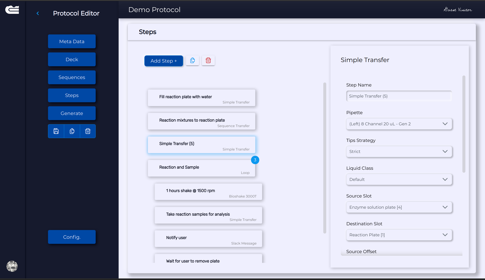
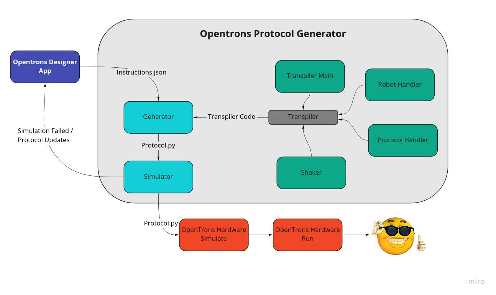

# OPiDi

A "No code" multiuser protocol designer server to program the OT2's liquid handling robots

----

Quick link to [Protocol Generator Docs](https://enginzyme-public.gitlab.io/opidi)



## Overview

Opentrons OT2 robots are inexpensive and versatile liquid handling robots developed and sold by Opentrons Labworks Inc. The robots source code is open and available in the [opentrons repository](https://github.com/Opentrons/opentrons).  The robots motion and liquid handling commands are sent directly from the robot's Raspberry Pi via python scripts.

The opentrons python library allows anyone with coding skills to program the robot protocols and add any custom hardware or software integrations. (It's a computer running python scripts after all!).  But for those with limited coding skills building and sharing protocols can be cumbersome. This is where OPiDi takes relevance:  a webapp to graphically generate robot protocols with no code.  

OPiDi can be used to easily create, use, and share unambiguously specified laboratory protocols which are reproducible, flexible, configurable, and consistent.

An instructions json file contains the protocol structure divided in two main sections: **Deck** and **Steps**

* Deck refers to the robot's deck setup:  labware location and the chosen pipettes.

* Steps is a list of standardized actions that will be executed sequentially. Such as
  * Simple Dispense
  * Sequence Dispense
  * Array Dispense
  * Loop
  * Shake 
  * Send Notification

## App architecture



The webapp **client** facilitates the creation of the instructions file and transpiles it into a downloadable python script. 

The **opentrons_protocol_generator** transpiler was primarily built to be extensible. Developer can include more step schemas to the instructions file and define the step actions within the transpiler templates.


The web app depends on the [protocol objects api](server/protocol_objects_api) for persistence and CRUD operations on created protocols and protocol dependencies such as labware, and pipette data. The protocol objects API sits a-top a protocol objects DB (provisioned as an AWS RDS instance).
The web app also depends on the [protocol generator api](server/protocol_generator_api) to either simulate protocol specifications sent from the web app, or to generate the Opentrons robot specific equivalent of the protocol.

## Getting Started

You can get started by running the docker container to spawn the server and clients in your local computer. 


Clone project

```
$ git clone https://gitlab.com/enginzyme-public/opentrons/opidi.git
```

Open project in terminal

```
$ cd opidi
```

Build a Docker image for the project (this step requires you to have Docker setup on your device)

```
$ docker compose build
```

Run a Docker container from the built image

```
$ docker compose run -d --name opidi-app -p 8007:8765 -p 5000:5000 web
```

Next, access the web application via this URL: http://localhost:8007

You can also access interactive Swagger docs for the API at http://localhost:5000/api/1/objects and http://localhost:5000/api/1/generator

For more information about using the generator backend and enabling slack messaging, please take a look at the [server's readme](server/README.md)


*Note*: By default, this project is run in a development environment (which uses a self-hosted SQLite database). To use a local or remote Postgres database in production, you can:

* Set the `FLASK_ENV` environment variable in the `docker-compose.yml` file to `prod`.
* Set the `DATABASE_URL` environment variable in the `docker-compose.yml` file to the connection string for your local or remote Postgres database.
* Set the values of the other environment variables that are commented out if you have them.
* Redo the docker image and container build procedures.
* Run the following commands to migrate the Postgres database.

```
$ docker compose run -d --name opidi-app -p 8007:8765 web pipenv run python manage.py db migrate
$ docker compose run -d --name opidi-app -p 8007:8765 web pipenv run python manage.py db upgrade
```

## Usage

The workflow in the app consists of creating, importing, or viewing an existing protocol. Either of these actions require that you follow up with the following steps:

* Setup the robot deck with labware, pipette, and tip rack choices.
* Optionally create location sequences to be used in sequence transfer steps.
* Specify the desired robot operations in steps.
* Export the underlying protocol object.
* Simulate the protocol to generate text output with which you may verify that the protocol will run correctly on the robot.
* Generate the corresponding robot specific protocol file. 


### Protocol management

With multiple users interacting with the app the list of protocols can be very quickly cluttered. The OPiDi app asks users to log in to their own space where they can create as many protocols as they wanted in their own sandbox.  Protocol files can then be flagged as verified and shared, with more restricted permissions to avoid accidental updates.

Further, the user can save changes made to a protocol, clone that protocol, or delete it entirely.

### To Enable Google Authentication
Follow [this guide](https://developers.google.com/identity/sign-in/web/sign-in) to obtain your Client ID for Google federated authentication.

Next, add `http://localhost:8007` to the allowed Javascript origins and redirect uris lists in the Google API console.

Further, add the following to the head of the `client/public/index.html` file:
```
<meta name="google-signin-client_id" content="<YOUR-CLIENT-ID>.apps.googleusercontent.com">
<script src="https://apis.google.com/js/platform.js"></script>
```

Finally, set the `VUE_APP_GOOGLE_AUTH_ENABLED` variable to `TRUE` in the `.env` files in the `client` subfolder.

You can view the user guide [here](USER_MANUAL.md)

## Maintainer(s)
tobi@enginzyme.com

nadim@enginzyme.com

stefan@enginzyme.com
