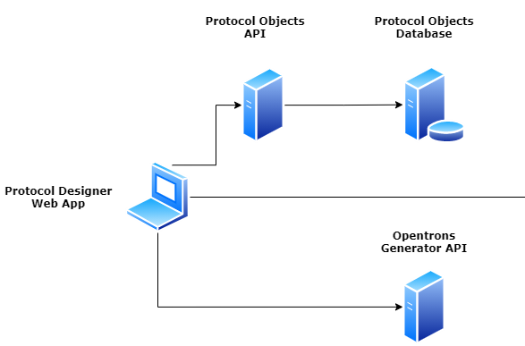

# OPiDi

## Overview
This project is about a web app that can be used to easily create, use, and share unambiguously specified laboratory protocols which are reproducible, flexible, configurable, and consistent.
These protocols are currently used to specify robot operations on the Opentrons platform. In the future, it can also be used for specifying robot operations on other manufacturers' platform (eg. Flowbot, Hamilton).
Google is used as the identity provider for the authentication layer of this web app. As a result users will first have to sign in via their email addresses before they gain access to it.
The workflow in the app consists of creating, importing, or viewing an existing protocol. Either of these actions require that you follow up with the following steps:

* Setup the robot deck with labware, pipette, and tip rack choices.
* Optionally create location sequences to be used in sequence transfer steps.
* Specify the desired robot operations in steps.
* Export the underlying protocol object.
* Simulate the protocol to generate text output with which you may verify that the protocol will run correctly on the robot.
* Generate the corresponding robot specific protocol file (a Python file in the case of the Opentrons bot) to be run on the hardware.

The user is enabled to mark a protocol as being “verified” upon actual verification via a test-run. The user is also enabled to share their protocol within a shared space provided by the web app.
Further, the user can save changes made to a protocol, clone that protocol, or delete it entirely.
## Architectural Overview



The web app depends on the [protocol generator api](server/protocol_objects_api) for persistence and CRUD operations on created protocols and protocol dependencies such as labware, and pipette data. The protocol objects API sits a-top a protocol objects DB (provisioned as an AWS RDS instance).
The web app also depends on the [protocol generator api](server/protocol_generator_api) to either simulate protocol specifications sent from the web app, or to generate the Opentrons robot specific equivalent of the protocol.

## Getting Started

Clone project

```
$ git clone https://gitlab.com/enginzyme-public/opentrons/opidi.git
```

Open project in terminal

```
$ cd opidi
```

Build a Docker image for the project (this step requires you to have Docker setup on your device)

```
$ docker compose up
```

Run a Docker container from the built image

```
$ docker compose run -d --name opidi-app -p 8007:8765 -p 5000:5000 web
```

Next, you can access the web application via this URL: http://localhost:8007

Also, you can access interactive Swagger docs for the API at http://localhost:5000/api/1/objects and http://localhost:5000/api/1/generator

*Note*: By default, this project is run in a development environment (which uses a self-hosted SQLite database).

However, you are able to use a local or remote Postgres database in the production environment via the following steps:
* Set the `FLASK_ENV` environment variable in the `docker-compose.yml` file to `prod`.
* Set the `DATABASE_URL` environment variable in the `docker-compose.yml` file to the connection string for your local or remote Postgres database.
* Set the values of the other environment variables that are commented out if you have them.
* Redo the docker image and container build procedures.
* Then run the following commands to migrate the Postgres database.

```
$ docker compose run -d --name opidi-app -p 8007:8765 web pipenv run python manage.py db migrate
$ docker compose run -d --name opidi-app -p 8007:8765 web pipenv run python manage.py db upgrade
```

### To Enable Google Authentication
Follow [this guide](https://developers.google.com/identity/sign-in/web/sign-in) to obtain your Client ID for Google federated authentication.

Next, add `http://localhost:8007` to the allowed Javascript origins and redirect uris lists in the Google API console.

Further, add the following to the head of the `client/public/index.html` file:
```
<meta name="google-signin-client_id" content="<YOUR-CLIENT-ID>.apps.googleusercontent.com">
<script src="https://apis.google.com/js/platform.js"></script>
```

Finally, set the `VUE_APP_GOOGLE_AUTH_ENABLED` variable to `TRUE` in the `.env` files in the `client` subfolder.

You can view the user guide [here](USER_MANUAL.md)

## Maintainer(s)
tobi@enginzyme.com

nadim@enginzyme.com

stefan@enginzyme.com
